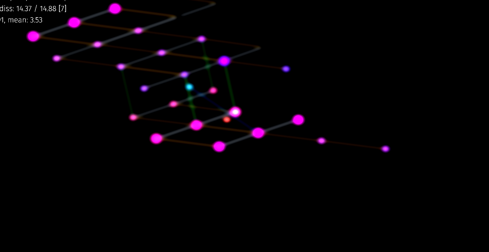

# Just intonation lattice visualizer for 22/31edo/free just intonation

## How to use

Intended for use with https://github.com/euwbah/microtonal-seaboard and https://github.com/euwbah/ji-performer/.

### Set up & [config file](./configs.js)

All the config variables start with `export const` in [`configs.js`](./configs.js).

When running with [microtonal-seaboard](https://github.com/euwbah/microtonal-seaboard) in 22edo/31edo mode:
- `EDO`: set to 22 or 31
- `HARMONIC_CONTEXT_METHOD`: set to `'cb'`, `'l2'`, or `'l2eo'`
- `SCULPTURE_MODE`: set to `false`

When running with [ji-performer](https://github.com/euwbah/ji-performer/):
- `EDO`: set to 12
- `HARMONIC_CONTEXT_METHOD`: set to `'12ji'`
- `SCULPTURE_MODE`: set to `false`

Remember to run the server first (microtonal-seaboard, ji-performer) before loading the visualizer. If nothing shows up, try refreshing, and check the browser developer console (F12, Ctrl+Shift+J) for errors.

There's a lot more configuration options pertaining to the harmonic context modelling (coefficients for heuristically simulating short term memory and perception of pitches), graphics (camera angles, zoom, speed, colors, shaders), and text appearance (display absolute ratios/relative ratios/monzos, use octave reduced prime intervals). They're (mostly) documented in JSDoc format.
## What is happening?

> This section is a bit outdated, it was written and still holds true for 31edo in `cb` harmonic context mode.

Each ball represents a note that is currently active or sustained by pedal (MIDI CC64).

The hue of the ball is based on its note's position in the circle of fifths, with dark orange being the note A, and the remaining notes given a hue by mapping the color wheel to the circle of 31 fifths.

The notes are positioned using a 5-dimensional coordinate system. The coordinates are a representation of the frequency ratios between notes. This is of the notion that sound can be fundamentally broken down into frequencies, and the ratios between frequencies is what we perceive as intervals. [Go to the xenwiki to explore this in detail](https://en.xen.wiki/w/Just_intonation).

The coordinate system is a slightly modified version of [Monzo notation](https://en.xen.wiki/w/Monzo). In this visualizer, the 5 axes: represent powers of the unit intervals 2/1, 3/2, 5/4, 7/4, and 11/8 respectively. (Note that standard Monzo vectors represent powers of the numbers 2, 3, 5, 7, 11, etc... instead of the octave-reduced intervals which were used to make the visualization less cluttered).

| Coordinates | Frequency ratio | Interval | Dieses (steps of 31 edo) |
| :---: | :--- | :--- | :--- |
| `[1 0 0 0 0>` | 2/1 | Octave | 31 |
| `[0 1 0 0 0>` | 3/2 | Perfect/Pythagorean fifth | 18 |
| `[0 0 1 0 0>` | 5/4 | Classic Major Third | 10 |
| `[0 0 0 1 0>` | 7/4 | Septimal Subminor Seventh | 25 |
| `[0 0 0 0 1>` | 11/8 | Undecimal super-fourth | 14 |

Any 11-prime-limit interval (i.e. its frequency ratio doesn't factorize with primes higher than 11) can be deconstructed into repeated multiplications or divisions of the above primary intervals. Going a positive step in any one axis represents multiplying the frequency by the associated primary interval, and going a negative step in any one axis represents division of the associated frequency ratio.

For example, the frequency interval of a major second is 9/8, which can be broken down into primary ratios as 3/2 × 3/2 ÷ 2. Referring to the table, that equates to going up two perfect fifths and down one octave, which is indeed a (Pythagorean) major second. Also referring to the table, we get the coordinate vectors `[0 1 0 0 0>` representing 3/2 and `[1 0 0 0 0>` representing 2/1. This means we can represent 9/8 as `2 × [0 1 0 0 0> - [1 0 0 0 0>` which gives us the final coordinate of `[-1 2 0 0 0>`. Such is the relative coordinate of the ball that is a major second interval away from the origin note.

As 31 edo is a tempered tuning (as all equal-temperaments are), the same step size in 31 edo
may correspond to various interval ratios ([see here](https://en.xen.wiki/w/31edo#Intervals)) depending on the harmonic context.

There is an algorithm implemented in [`harmonic-context.js`](https://github.com/euwbah/31edo-lattice-visualiser/blob/master/harmonic-context.js) that computes the intended frequency ratios between each note played in 31 edo. This algorithm is a heuristic modelling of the brain's short term memory recall of pitches as per [Diana Deutsch's](https://deutsch.ucsd.edu/psychology/pages.php?i=209) empirical findings, fused with the perception of consonance of intervals as per [William Sethares' 'dissonance calculating algorithm'](https://sethares.engr.wisc.edu/comprog.html) which models the [critical bandwidth phenomenon](https://www.mpi.nl/world/materials/publications/levelt/Plomp_Levelt_Tonal_1965.pdf).

[Commas](https://en.xen.wiki/w/Comma) are small discrepancies between two intervals of different frequency ratios, where the two intervals end up being the same interval in a tempered tuning system. The [numerous commas](https://en.xen.wiki/w/31edo#Commas) that 31 edo tempers out cause the coordinates of the notes to continuously stray further away from the origin as the song progresses. At times, multiple balls at different coordinates representing the same note would simultaneously be present, especially if the sustain pedal is held down for a long while, representing how that one note is a double, or even triple entendre of an interval with respect to the other notes present.

Now with the coordinates of the notes ascertained, the visualizer maps the 5D coordinates down to 2D in various ways. So far, hyperbolic 2D and exponential/log space projections are implemented. (Hyperbolic 3D coming soon) The down-projection of 5 dimensions leaves much room for artistic expression.

Between the notes, there are scaffolding rods connecting them. Each rod represents one unit in the direction of its axis, and the axes are colour coded. As of the time of writing, these colours correspond to:

| Colour | Coordinate | Interval |
| :---: | :--- | :--- |
| White/very pale blue | `[1 0 0 0 0>` | Octave |
| Yellow | `[0 1 0 0 0>` | Perfect/Pythagorean fifth |
| Green | `[0 0 1 0 0>` | Classic Major Third |
| Dark Blue/Purple | `[0 0 0 1 0>` | Septimal Subminor Seventh |
| Brown/Dark orange | `[0 0 0 0 1>` | Undecimal super-fourth |

When new notes are registered, the rods only extend out from the set of notes which are deemed to be part of the 'Harmonic Context' which is the culmination of the pitch memory space, dissonance measure, time, and other heuristics applied to calculate what can be thought of as the 'tonal center'. As such, each new note is contextualised with respect to the most prominent sounds that linger on in the listeners short term memory, with the frequency ratio being the most obvious solution at that particular point in time.

Finally, there is a particle generator/flare in central focus, which is in constant pursuit of a small, like-coloured ball. The small ball represents the [centroid](https://en.wikipedia.org/wiki/Centroid) (_center-of-mass/average position_) of the notes that are currently present in the 'Harmonic Context'. These elements were initially for debugging, and may be included for aesthetic reasons. The flare color is the [circular mean](https://en.wikipedia.org/wiki/Circular_mean) of the hue colors of the pitches in the Harmonic Context, according to the circle of fifths.

The dynamics of the music may also affect the rotation, position, zoom and speed of the geometry/axes projection camera; post-effects; and vibrational jitter of elements.

## For devs

Project for Sethares' dissonance calculations in WebAssembly/Rust: https://github.com/euwbah/dissonance-wasm.

If you don't have a Seaboard but have some other 31edo MIDI instrument (e.g. Lumatone), and don't mind patching some code of your own, here's the list of WebSocket messages that this visualizer supports. Simply start host a local non SSL/TLS WebSocket server using the address: `ws://localhost:8765`

`on:8:127`: Register a note on event for the note 8 edosteps above A4 (C5), at the MIDI velocity 127.

`off:8:127`: Register a note off event for the note C5, at the key off velocity of 127. (As of now, Key off velocities don't affect how notes appear in the visualizer)

`cc:64:127`: Register a midi CC message for the CC 64 (sustain pedal) with the max value 127. Sustain pedal information is sent using CC messages and affects sustain of notes in the visualizer.

`cc:123:0`: Any value sent to CC 123 will turn off all notes (Off All Notes special CC message).

## Contact

If you wish to find out more about the methodology behind this project, talk about generalised functional tonal harmony in any tuning system, or have issues with getting it to work for you, feel free to send me a DM on my instagram profile: https://www.instagram.com/euwbah/ or discord: euwbah#1417.

If there's a bug or feature request, [do submit an issue](https://github.com/euwbah/31edo-lattice-visualiser/issues/new).
